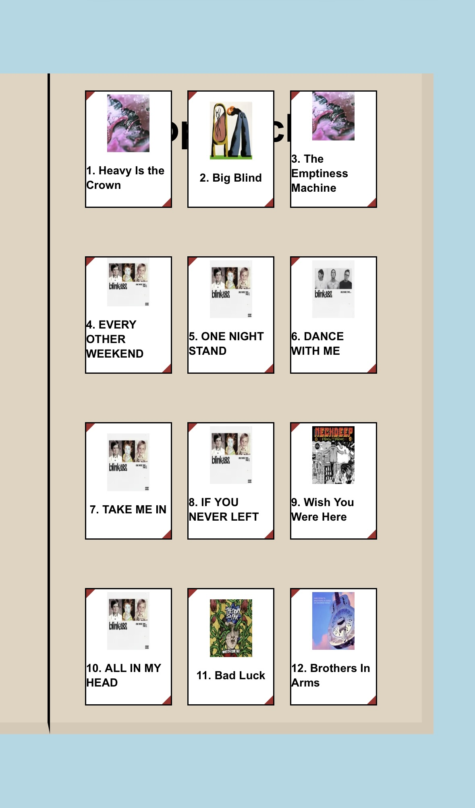

# Scrapbookify
This is an interactive, scrapbook style spotify app, built using NextJS. The intention of the app is to show user listening habits in a scrapbook form

The app prompts the user to login using spotify, and once redirected back to the app, allows the user to see their top songs/artists of the last -
- 4 Weeks
- 6 Months
- All time

The app is currently deployed using Vercel, however due to spotifys API rules, only the spotify accounts on the projects whitelist is able to access the app. So non whitelisted users will only be able to see the home page

https://scrapbookify.vercel.app/



## Future Development items
- Update the css to be more responsive for other devices. The CSS currently formats incorrectly on most devices
- Meet the spotify API requirements to have the app publilshed publically

## Getting Started

First, run the development server:

```bash
npm run dev
```

Open [http://localhost:3000](http://localhost:3000) with your browser to see the result.
